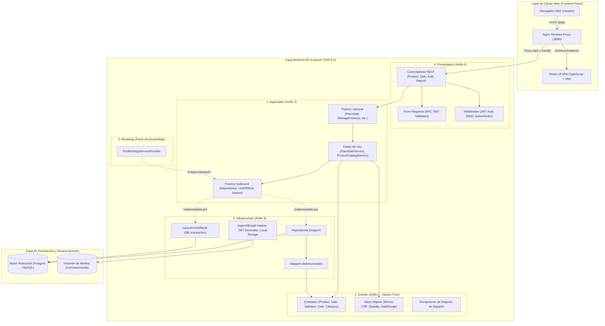
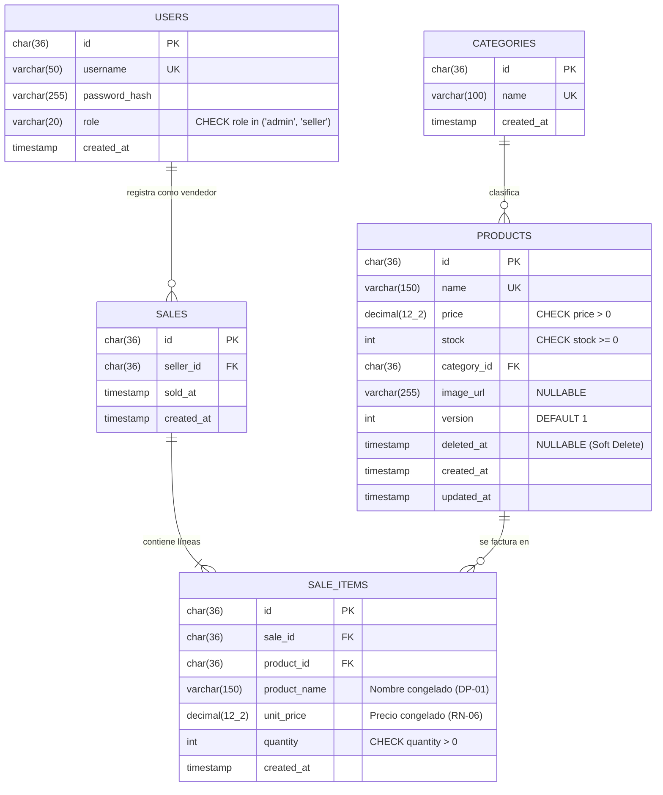
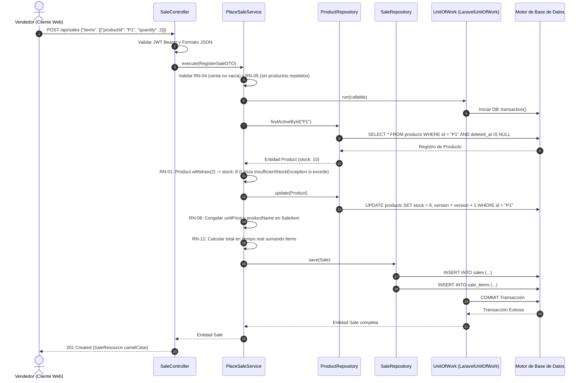

# Simple Stock Flow · Documentación Técnica y Manual de Entrega

> **Prueba Técnica de Desempeño SDD (Spec-Driven Development)**  
> **Servicio Nacional de Aprendizaje (SENA) · Análisis y Desarrollo de Software (ADSO)**  
> **Ficha:** 3413974  
> **Aprendiz:** Paula Claros (GitHub: [`paulaclaros`](https://github.com/paulaclaros))  
> **Stack Implementado:** PHP 8.2 (Laravel 10/11) + React 18 (Vite + TypeScript) + MySQL / PostgreSQL + Docker Compose  

---

## 1. Resumen Ejecutivo y Metodología SDD

La prueba técnica *Simple Stock Flow* evalúa la competencia en **Spec-Driven Development (SDD)**: la capacidad de tomar una especificación técnica rigurosa (entregada en Python y .NET), interpretarla formalmente y materializarla en el stack del reto (**PHP con Laravel** en el backend y **React con TypeScript** en el frontend).

### Principios Fundamentales Cumplidos
1. **La especificación es la ley:** Se respetaron todas las reglas de negocio (RN-01 a RN-12), decisiones de producto (DP-01 a DP-04), invariantes monetarias y el contrato de API REST en formato `camelCase` estricto con errores RFC 7807 (`application/problem+json`).
2. **Dominio Puro (Arquitectura Onion de 4 Capas):** La capa de Dominio en PHP está 100% aislada de dependencias de frameworks (cero Eloquent, cero Laravel, cero facades).
3. **Persistencia Rigurosa con Mappers:** Modelos Eloquent aislados en Infraestructura. La entidad de Dominio `Product` no conoce la columna `version`, delegando el control optimista de concurrencia al Mapper y al repositorio.
4. **Ecosistema Modular de 6 Repositorios:** Siguiendo la instrucción estricta del SENA, se desarrollaron los 6 repositorios forkeados individualmente:
   - `test-simple-stock-flow-docs`
   - `test-simple-stock-flow-api`
   - `test-simple-stock-flow-app`
   - `test-simple-stock-flow-infra`
   - `test-simple-stock-flow-page`
   - `test-simple-stock-flow-tool`

---

## 2. Diagramas de Arquitectura y Flujos

### 2.1. Arquitectura Global de la Solución (Onion Architecture de 4 Anillos + Bootstrap)



---

### 2.2. Modelo Entidad-Relación de la Base de Datos



---

### 2.3. Diagrama de Secuencia: Venta Transaccional Atómica (RN-01, RN-04, RN-05, RN-06, RN-12)



---

## 3. Matriz de Cumplimiento de Reglas de Negocio (RN-01 a RN-12)

| Regla | Descripción | Dónde se cumple | Prueba que lo demuestra |
|---|---|---|---|
| **RN-01** | El stock nunca es negativo | `Product::withdraw()` + Check SQL | `tests/Unit/Domain/ProductTest.php` |
| **RN-02** | El precio es mayor que cero | `Money::fromDecimal()` + Check SQL | `tests/Unit/Domain/ValueObjectsTest.php` |
| **RN-03** | La cantidad es mayor que cero | `Quantity::fromInt()` + Check SQL | `tests/Unit/Domain/ValueObjectsTest.php` |
| **RN-04** | Una venta tiene al menos una línea | `Sale` + `PlaceSaleService` | `tests/Unit/Domain/SaleTest.php` |
| **RN-05** | No se repite producto en la venta | `PlaceSaleService` | `tests/Unit/Application/PlaceSaleServiceTest.php` |
| **RN-06** | Precio y nombre se congelan al vender | `SaleItem` congela atributos | `tests/Unit/Domain/SaleTest.php` |
| **RN-07** | Venta registrada no se modifica ni anula | Ausencia de métodos PUT/DELETE | Arquitectura verificada |
| **RN-08** | Producto vendido no se borra (baja lógica) | `Product::deactivate()` | `tests/Unit/Domain/ProductTest.php` |
| **RN-09** | Importes en la misma moneda | Value Object `Money` ('COP') | `tests/Unit/Domain/ValueObjectsTest.php` |
| **RN-10** | `username` único, minúsculas | Value Object `Username` | Validado en servicio y base de datos |
| **RN-11** | Rol cerrado `{admin, seller}` | Value Object `Role` + Check SQL | Validado en middleware y entidades |
| **RN-12** | Total es siempre la suma de sus líneas | Calculado en tiempo de ejecución | `tests/Unit/Domain/SaleTest.php` |

---

## 4. Guía de Ejecución Rápida

### A. Frontend Web en Desarrollo
```bash
cd test-simple-stock-flow-app
npm install
npm run dev
# Abrir en navegador: http://localhost:4200/
```

### B. Ejecución de Pruebas Unitarias y de Arquitectura
```bash
cd test-simple-stock-flow-api
bash verify.sh
```

### C. Despliegue con Docker Compose
```bash
cd test-simple-stock-flow-infra
docker compose up -d --build
```
